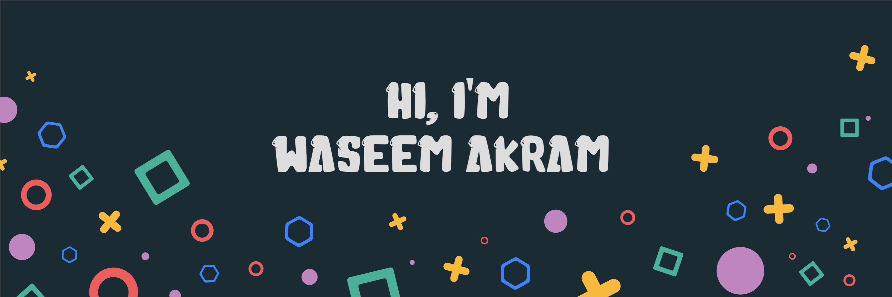

Hey there 👋

I’m Wassem Akram, a Information security enthusiast with Certified Ethical Hacker certification and strong interest in information security, specifically penetration testing and offensive security. Strong background in security tools, emerging technologies, processes and best practices. Senior full-stack engineer, creative coder and self-proclaimed designer who specializes in front-end development. I make it my mission to translate user-focused designs into pixel-perfect websites or applications that run blazing fast.

Want to know more about me? [Check out my portfolio.](https://bit.ly/hackerwasiisg/)

## 📝 Latest Blog Posts

 

<!-- BLOG-POST-LIST:START -->
- [How to Spoof Messages](https://hackerwasii.blogspot.com/2021/04/how-to-spoof-sms-messages.html)
- [Identifying Devices on a Network](https://hackerwasii.blogspot.com/2021/07/identifying-devices-on-network.html)
- [How to install MinGW C/C++ Compiler in Windows 11 or 10](https://hackerwasii.blogspot.com/2021/12/how-to-install-mingw-cc-compiler-in.html)
- [How to Feel Empowered as a Developer](https://braydoncoyer.dev/blog/how-to-feel-empowered-as-a-developer)
- [How to Create a Chat Layout with TailwindCSS and CSS Grid](https://braydoncoyer.dev/blog/how-to-create-a-chat-layout-with-tailwindcss-and-css-grid)
<!-- BLOG-POST-LIST:END -->

 

## 📌 Pinned Repositories

 

 

 

 

 
 

## &#x1f4c8; GitHub Stats

 

 
 

## 💼 Skills

More Skills

 

 

 

 

## 📣 How about an quote before you go?

> Making time to step back and actively assess a situation is critical to being able to make good decisions. This sort of perception might not come naturally – but it’s a necessary skill.
In other words, try smarter.🙃
>
> 
- wasii 🌸🖤

Check back at the top of the hour for a new quote!

 
