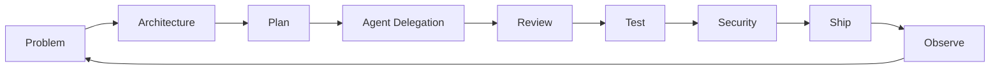

<div align="center">

# Waseem Akram

### AI Engineer · AI Automation · Full-Stack Engineering · DevOps

Building production AI systems, agentic workflows, automation, full-stack products, and reliable cloud infrastructure.

[](https://wasii.dev)
[](https://www.linkedin.com/in/hackerwasii)
[](https://github.com/evildevill)
[](mailto:support@hackerwasii.com)

<br/>

**Building & shipping software since 2020**

</div>

---

## About Me

I'm **Waseem Akram**, an **AI Engineer and Full-Stack Software Engineer** from Pakistan.

I've been building software since **2020**, starting with Linux, scripting, automation, cybersecurity, and web development, then expanding into full-stack product engineering, mobile apps, browser extensions, developer tooling, cloud infrastructure, and AI systems.

Today, my main focus is **AI engineering, agentic systems, and AI automation** — building systems where LLMs, agents, tools, APIs, retrieval, structured data, automation workflows, and traditional software architecture work together in production.

I don't treat AI as a replacement for engineering.

I use AI as part of the engineering stack while still owning:

- Architecture
- Backend & APIs
- Databases
- Frontend & mobile
- Infrastructure
- Security
- Testing & debugging
- Evaluation
- Production delivery

> **AI can generate code. Engineering is deciding what should be built, how it should work, whether it is correct, and whether it deserves to reach production.**

---

## Real-World Impact

<table>
<tr>
<td align="center" width="25%">
<h2>122K+</h2>
<strong>Chrome Users</strong>
<br/>
<sub>Across published extensions</sub>
</td>

<td align="center" width="25%">
<h2>38K+</h2>
<strong>VS Code Installs</strong>
<br/>
<sub>Developer tooling</sub>
</td>

<td align="center" width="25%">
<h2>100K+</h2>
<strong>GPT Conversations</strong>
<br/>
<sub>Custom ChatGPT GPT</sub>
</td>

<td align="center" width="25%">
<h2>1.3K+</h2>
<strong>GitHub Followers</strong>
<br/>
<sub>Developer community</sub>
</td>
</tr>
</table>

<div align="center">

**3 Android apps published · Multiple 4.6★+ products · Largely organic growth**

</div>

> These are intentionally shown as separate metrics — users, installs, conversations, and community reach — rather than combined into an artificial "total users" number.

---

## AI Engineering & Automation

I build AI systems as part of the **application architecture**, not as thin wrappers around a chat box.

```text
User / Application
        │
        ▼
  AI Orchestration
        │
 ┌──────┼────────────┐
 ▼      ▼            ▼
LLM   Tools      Retrieval
 │      │            │
 └──────┼────────────┘
        ▼
   APIs / Services
        │
        ▼
 PostgreSQL / Data
        │
        ▼
 Infrastructure
```

### Areas I work with

`AI Agents` · `Agent Orchestration` · `AI Automation` · `LLM APIs` · `Tool Calling` · `RAG` · `Structured Outputs` · `Context Engineering` · `Local LLMs` · `Evaluation`

I actively use AI coding agents for:

- Planning
- Implementation
- Refactoring
- Debugging
- Testing
- Code review
- Research
- Documentation

But architecture, constraints, validation, and production decisions remain engineering responsibilities.

---

## Selected Products

<table>
<tr>
<td width="50%" valign="top">

### Absolute Enable Right Click & Copy

**99K+ users · ★ 4.63**

My largest Chrome extension, grown to nearly **100K users** without paid marketing.

`Chrome Extensions` `JavaScript` `Browser APIs`

</td>

<td width="50%" valign="top">

### Firewall Bypass VU

**19K+ users · ★ 4.68**

A productivity-focused Chrome extension built around the Virtual University ecosystem.

`Chrome APIs` `Automation` `AI`

</td>
</tr>

<tr>
<td width="50%" valign="top">

### Acadora

A production learning platform published on Google Play.

Features include guided learning, MCQ practice, short lectures, search, progress tracking, theming, and study tools.

`React Native` `Expo` `Next.js` `Supabase`

</td>

<td width="50%" valign="top">

### Greeny

A transit platform built around real-world public transport data.

Thousands of stops, routes, schedules, ingestion pipelines, location-aware functionality, and automated data workflows.

`React Native` `PostgreSQL` `Supabase` `GitHub Actions`

</td>
</tr>
</table>

---

## Browser Extensions

| Product | Reach | Rating |
|---|---:|---:|
| Absolute Enable Right Click & Copy | **99K+ users** | **4.63★** |
| Firewall Bypass VU | **19K+ users** | **4.68★** |
| DarkPDF | **1.5K+ users** | **4.13★** |
| NetAcad Smart Copier | **1K+ users** | **5.0★** |

**122K+ combined users across published Chrome extensions.**

---

## Developer Tools

<table>
<tr>
<td align="center" width="50%">

### Jinja Snippets Flask

<h2>29K+</h2>

**VS Code Marketplace installs**

Developer tooling for improving Flask/Jinja development workflows.

</td>

<td align="center" width="50%">

### BashSnippets

<h2>9K+</h2>

**VS Code Marketplace installs**

Productivity-focused Bash scripting snippets for Visual Studio Code.

</td>
</tr>
</table>

**38K+ combined VS Code Marketplace installs.**

---

## Mobile Apps

I've shipped multiple production Android applications through Google Play.

### Acadora

A privacy-focused learning platform built with React Native/Expo and backed by a full-stack API and data platform.

[](https://play.google.com/store/apps/details?id=com.acadora.wasii)

### Noor Al-Qalb

A published Android application available on Google Play.

[](https://play.google.com/store/apps/details?id=dev.wasii.nooralqalb)

### Habit Tracker

A production habit-tracking application published on Google Play.

[](https://play.google.com/store/apps/details?id=com.habittrackerwasiii.app)

---

## How I Build With AI


```mermaid
flowchart LR
    A[Problem] --> B[Architecture]
    B --> C[Plan]
    C --> D[Agent Delegation]
    D --> E[Review]
    E --> F[Test]
    F --> G[Security]
    G --> H[Ship]
    H --> I[Observe]
    I --> A
```

My workflow is built around **AI orchestration, not blind generation**.

```text
Understand the problem
        ↓
Design architecture
        ↓
Break work into executable tasks
        ↓
Delegate appropriate work to AI agents
        ↓
Review implementation
        ↓
Test assumptions and edge cases
        ↓
Debug / refactor
        ↓
Validate security and data flows
        ↓
Ship
        ↓
Observe real-world behavior
        ↓
Iterate
```

The goal is not to generate more code.

**The goal is to ship better software faster without giving up engineering judgment.**

---

## Engineering Stack

### AI & Agentic Systems

<p>


</p>

### Application Engineering

<p>


</p>

### Data & Infrastructure

<p>


</p>

### Security Background

<p>


</p>

Cybersecurity is where a major part of my engineering journey started, and that background still shapes how I think about authentication, permissions, API design, browser security, data exposure, and defensive engineering.

---

## Current Focus

I'm currently going deeper into:

```text
Agentic AI
LLM application architecture
AI orchestration
RAG & retrieval systems
AI evaluation
Tool / function calling
Context engineering
Local & open-source LLMs
Full-stack AI products
React Native
Next.js
PostgreSQL / Supabase
Cloud infrastructure
CI/CD & automation
Production AI reliability
```

I'm particularly interested in roles such as:

- **AI Engineer**
- **AI Automation Engineer**
- **Full-Stack AI Engineer**
- **Agentic AI Engineer**
- **AI Product Engineer**
- **Software Engineer — AI Platform**
- **DevOps / Cloud Engineer for AI-enabled products**

---

## My Journey

I've been building software since **2020**.

```text
Cybersecurity & Linux
        ↓
Automation & Scripting
        ↓
Web Development
        ↓
Browser Extensions
        ↓
Full-Stack Engineering
        ↓
Mobile Development
        ↓
Cloud & DevOps
        ↓
AI Engineering & Agentic Systems
```

That breadth is intentional.

Understanding systems from the browser and application layer down to APIs, databases, infrastructure, Linux, networking, and security makes me a stronger AI engineer today.

---

## Engineering Philosophy

```text
Build → Ship → Measure → Learn → Improve
```

I care about practical engineering over hype.

A beautiful architecture nobody uses is not automatically better than a boring system serving thousands of people reliably.

Likewise, an application is not valuable simply because it contains an LLM.

**It should solve a real problem.**

---

<picture data-importer="pacman">
  <source media="(prefers-color-scheme: dark)" srcset="https://raw.githubusercontent.com/evildevill/evildevill/pacman-output/pacman-contribution-graph-dark.svg?game=pacman">
  <source media="(prefers-color-scheme: light)" srcset="https://raw.githubusercontent.com/evildevill/evildevill/pacman-output/pacman-contribution-graph.svg?game=pacman">
  
</picture>

[](https://hackerwasii.com)

## Latest Writing

<!-- BLOG-POST-LIST:START -->
- [Active Directory Pentesting Resources (2025 Guide)](https://wasii.dev/blog/active-directory-resources)
- [Cipher's Secret Message – TryHackMe Walkthrough](https://wasii.dev/blog/ciphers-secret-message-tryhackme-walkthrough)
- [Volatility Essentials Walkthrough – Complete Memory Forensics Guide with Volatility 3](https://wasii.dev/blog/volatility-essentials-tryhackme-walkthrough)
- [Roundcube RCE Vulnerability Explained [CVE-2025-49113]](https://wasii.dev/blog/roundcube-cve-2025-49113-tryhackme-walkthrough)
- [Getting Started with Bash Scripting](https://wasii.dev/blog/getting-started-with-bash-scripting)
<!-- BLOG-POST-LIST:END -->

---

<div align="center">

### Build things. Ship them. Let real users decide.

**AI Engineering · AI Automation · Agentic Systems · Full-Stack · DevOps · Cloud · Security**

[Website](https://wasii.dev) · [LinkedIn](https://www.linkedin.com/in/hackerwasii) · [GitHub](https://github.com/evildevill)

</div>
